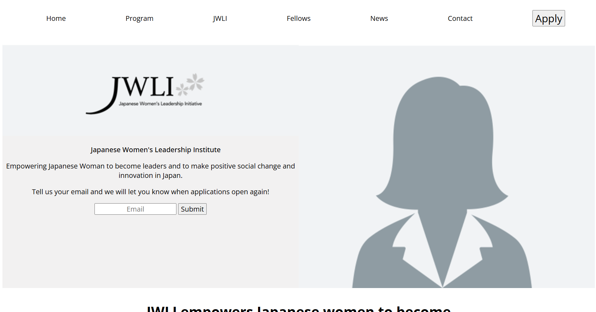
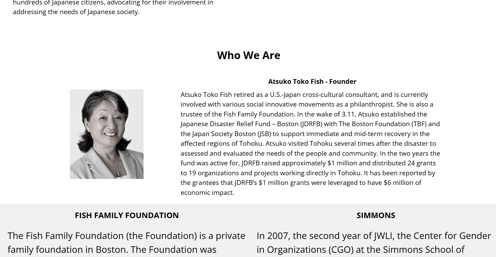

## JWLI
This website was created for the Japanese Women’s Leadership Institution, designed to showcase 
their mission, programs, and resources aimed at empowering women in leadership roles. It provides  
essential information on events, programs, and contact details to support the institution’s goals. 
Link to project <a href="https://dougiethedevjwli.netlify.app">here</a>

 
 

 
## Tech Used
HTML5
 
Used for structuring the content, including sections for the institution’s mission, leadership programs, upcoming events, and contact information 
CSS3
 
Styled the site to reflect professionalism and empowerment, using a clean and elegant design. The layout was made responsive to ensure it looks great on both desktop and mobile devices
 
 
## Lesson Learned
I learned how to align the design elements with the institution’s brand values, using color schemes, fonts, and images that reflect the institution's mission and vision.
